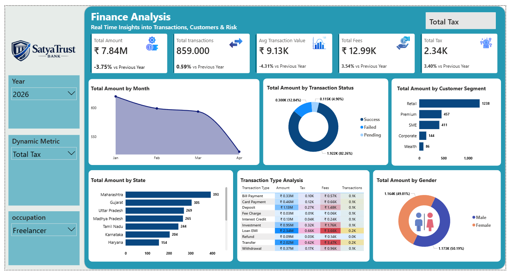

# Finance-Analysis-Dashboard
Financial Analysis is an interactive, visually streamlined data dashboard built completely in Power BI. It provides real-time insights into transaction trends, customer segments, and key financial metrics.

# Finance Analysis Dashboard 📊

## Project Overview
This repository features an interactive data visualization dashboard designed to provide real-time insights into financial transactions, customer demographics, and risk factors. The project focuses on intuitive UI/UX design to translate complex financial datasets into clear, actionable business intelligence.

## Key Features & Insights
The dashboard is structured to give stakeholders a comprehensive view of operational performance through several key visualizations and metrics:

*   **Executive KPIs:** High-level tracking of Total Amount, Total Transactions, Average Transaction Value, Total Fees, and Total Tax, complete with Year-over-Year (YoY) performance indicators.
*   **Trend Analysis:** A monthly line chart mapping transaction volume trends to identify seasonal dips or peaks over time.
*   **Operational Risk & Status:** A donut chart breaking down transaction statuses (Success, Failed, Pending) to monitor system reliability and payment gateways.
*   **Customer Segmentation:** Bar charts illustrating the total amount generated across different client tiers (Retail, Premium, SME, Corporate, and Wealth).
*   **Geographic Distribution:** State-wise breakdown of transaction volumes (highlighting regions like Maharashtra, Gujarat, and Uttar Pradesh).
*   **Transaction Type Matrix:** A granular breakdown of specific activities (Bill Payments, Card Payments, Deposits, Loan EMIs, Transfers, etc.) detailing their respective transaction counts, fees, and tax implications.
*   **Demographic Breakdown:** Transaction distribution analyzed by gender.
*   **Dynamic Filtering:** Interactive slicers on the left panel allow users to dynamically filter the entire dashboard by Year, specific Dynamic Metrics, and Customer Occupation.

## Repository Structure
*   `data/` - Contains the raw and pre-processed datasets used to build the visualizations.
*   `dashboards/` - The source files for the interactive dashboard.
*   `assets/` - Directory for project images and UI elements, including `Finance Analysis Screenshot.png`.
*   `README.md` - Project documentation and overview.

## How to Use
1.  Clone this repository to your local environment.
2.  Navigate to the `dashboards/` folder and open the primary visualization file in your BI tool (e.g., Power BI, Tableau).
3.  Ensure the data sources are correctly mapped to the files in the `data/` directory.
4.  Use the left-hand navigation pane to filter the data and explore the dynamic metrics.
